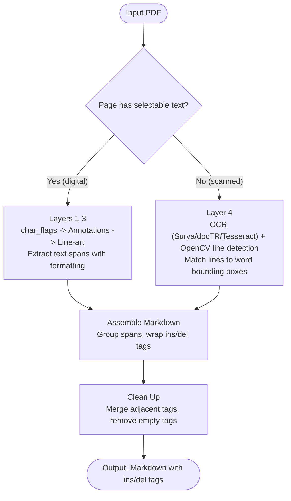
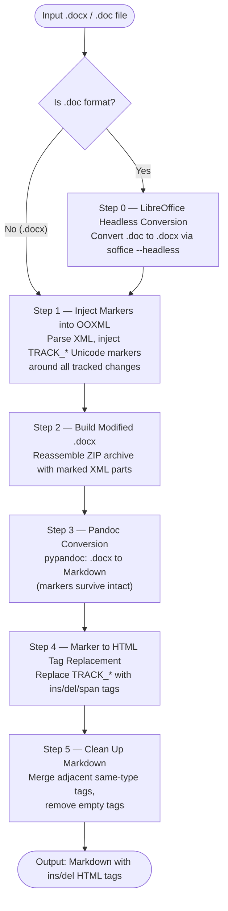

# Document Track Changes to Markdown — DOCX, DOC & PDF Change Markup Converter

<p align="center">
  
  
  
  
  
  
  
  
  
  
  
</p>

<p align="center">
Converts Word documents (<code>.docx</code>, <code>.doc</code>) and <code>.pdf</code> files with tracked changes into Markdown with <code>&lt;ins&gt;</code> / <code>&lt;del&gt;</code> HTML tags preserving the full change markup.
</p>

<p align="center">
<b>DOCX/DOC:</b> Injects Unicode markers into OOXML, converts via Pandoc, then replaces markers with HTML tags.<br>
<b>PDF:</b> Detects underline (<code>&lt;ins&gt;</code>) and strikethrough (<code>&lt;del&gt;</code>) formatting via a 4-layer detection strategy.
</p>

---

## Table of Contents

- [Overview](#overview)
- [Installation](#installation)
  - [Python Dependencies](#python-dependencies)
  - [System Dependencies](#system-dependencies)
  - [OCR Engine Setup](#ocr-engine-setup)
  - [Verifying the Installation](#verifying-the-installation)
- [Usage](#usage)
  - [Unified Entry Point — convert.py](#unified-entry-point--convertpy)
  - [Batch / Folder Mode](#batch--folder-mode)
  - [PDF Pipeline — pdf_parsing.py](#pdf-pipeline--pdf_parsingpy)
  - [DOCX/DOC Pipeline — docx_parsing.py](#docxdoc-pipeline--docx_parsingpy)
  - [Library Usage](#library-usage)
- [OCR Engine Comparison](#ocr-engine-comparison)
- [PDF 4-Layer Detection Strategy](#pdf-4-layer-detection-strategy)
- [PDF Conversion Pipeline](#pdf-conversion-pipeline)
- [DOCX/DOC Conversion Pipeline](#docxdoc-conversion-pipeline)
  - [The Tracked-Change Type Model](#the-tracked-change-type-model)
  - [Pipeline Steps](#pipeline-steps)
- [Retaining Formulas from `.doc` Files](#retaining-formulas-from-doc-files)
  - [Why this is hard](#why-this-is-hard)
  - [The breakthrough: embedded WordML in the Data stream](#the-breakthrough-embedded-wordml-in-the-data-stream)
  - [Extraction pipeline, step by step](#extraction-pipeline-step-by-step)
  - [Worked example](#worked-example)
  - [When this path succeeds vs. falls back to OCR](#when-this-path-succeeds-vs-falls-back-to-ocr)
- [Appendix A — Marker Strings](#appendix-a--marker-strings)
- [Appendix B — Marker-to-HTML Tag Map](#appendix-b--marker-to-html-tag-map)
- [Appendix C — Batch .doc to .docx Converter](#appendix-c--batch-doc-to-docx-converter)

---

## Overview

This project provides a unified converter and two pipeline-specific tools that convert documents with tracked changes into Markdown with `<ins>`/`<del>` HTML tags:

| Tool | Input | Track Change Method | Output |
|:---|:---|:---|:---|
| `convert.py` | `.docx`, `.doc`, `.pdf`, or a **folder** | Auto-detects file type and routes to the correct pipeline; folder input runs batch mode | Markdown with `<ins>`/`<del>`/`<span>`; Excel summary in batch mode |
| `docx_parsing.py` | `.docx`, `.doc` | Word tracked changes (OOXML `<w:ins>`, `<w:del>`, etc.) | Markdown with `<ins>`/`<del>`/`<span>` |
| `pdf_parsing.py` | `.pdf` | Visual strikethrough & underline | Markdown with `<ins>`/`<del>` |

---

## Installation

### Python Dependencies

Requires **Python 3.10+**. Install everything with:

```bash
pip install -r requirements.txt
```

Or install by pipeline:

```bash
# DOCX/DOC pipeline only
pip install lxml pypandoc olefile tqdm openpyxl

# PDF pipeline (core + default OCR engine)
pip install pymupdf opencv-python-headless surya-ocr "transformers>=4.56,<5" tqdm openpyxl
```

`openpyxl` is used by batch mode to write the per-run Excel summary. It is not needed for single-file conversions.

### System Dependencies

| Dependency | Required For | Install |
|:---|:---|:---|
| **pandoc** | DOCX/DOC pipeline | See below |
| **LibreOffice** | `.doc` input only (not needed for `.docx`) | See below |
| **tesseract** | Only if using `--ocr-engine tesseract` | See below |

**Pandoc** (required for DOCX/DOC):

```bash
# macOS
brew install pandoc

# Ubuntu / Debian
sudo apt install pandoc

# RHEL / CentOS
sudo yum install pandoc

# Or download from https://pandoc.org/installing.html
```

**LibreOffice** (only for `.doc` input):

```bash
# macOS
brew install --cask libreoffice

# Ubuntu / Debian
sudo apt install libreoffice

# RHEL / CentOS
sudo yum install libreoffice
```

**Tesseract** (only if using `--ocr-engine tesseract`):

```bash
# macOS
brew install tesseract

# Ubuntu / Debian
sudo apt install tesseract-ocr

# RHEL / CentOS
sudo yum install tesseract
```

### OCR Engine Setup

The PDF pipeline supports three OCR engines for scanned pages. Install at least one.

#### Surya (default)

Best raw text accuracy. Uses deep learning models that download automatically on first run (~1.5 GB).

```bash
pip install surya-ocr "transformers>=4.56,<5"
```

**Notes:**
- First run downloads models to `~/.cache/datalab/models/` — expect a one-time delay.
- Runs on CPU by default. For GPU acceleration, ensure PyTorch has CUDA/MPS support.
- License: GPL-3.0 code; model weights free for research, personal use, and startups under $2M revenue. Commercial use beyond that requires a license from [datalab.to](https://datalab.to).
- **Important:** Requires `transformers` version 4.x (not 5.x). The `requirements.txt` pins this correctly.

#### docTR (alternative)

Good balance of formatting detection accuracy and speed. Apache-2.0 licensed.

```bash
pip install "python-doctr[torch]"
```

**Notes:**
- First run downloads models to `~/.cache/doctr/models/` (~160 MB total).
- Uses PyTorch backend. For TensorFlow: `pip install "python-doctr[tf]"`.

#### Tesseract (alternative)

Fastest engine. No Python package needed — uses PyMuPDF's built-in Tesseract integration.

```bash
# macOS
brew install tesseract

# Ubuntu / Debian
sudo apt install tesseract-ocr

# RHEL / CentOS
sudo yum install tesseract
```

**Notes:**
- No model download needed — ships with language packs.
- Only the system binary is required; PyMuPDF handles the Python integration.

### Verifying the Installation

```bash
# Check PDF pipeline with default OCR (Surya)
python pdf_parsing.py input/file.pdf --ocr-engine surya

# Check DOCX pipeline
python docx_parsing.py input/file.docx

# Check unified entry point
python convert.py input/file.pdf
python convert.py input/file.docx
```

If a specific OCR engine isn't installed, the pipeline logs a warning and falls back to Tesseract.

---

## Directory Layout

```
.
├── input/                              ← place your source files here (.doc, .docx, .pdf)
├── output/                             ← converted Markdown files are written here by default
│   ├── .convert_state.json             ← skip-tracking state (batch mode; auto-created)
│   └── conversion_summary_YYYYMMDD_HHMMSS.xlsx  ← per-run Excel report (batch mode)
├── convert.py
├── docx_parsing.py
├── pdf_parsing.py
└── ...
```

---

## Usage

### Unified Entry Point — `convert.py`

Auto-detects file type and routes to the correct pipeline. Pass a **file** for single-file mode or a **directory** for batch mode.

```bash
# ── Single-file mode ─────────────────────────────────────────────────────────
# Default: output goes to output/<stem>.md (created automatically)
python convert.py input/file.docx
python convert.py input/file.doc
python convert.py input/file.pdf
python convert.py input/file.pdf --ocr-engine doctr
python convert.py input/file.pdf --ocr-engine tesseract
python convert.py input/file.docx -f gfm

# Explicit output path
python convert.py input/file.docx output/custom.md
```

| Argument | Required | Default | Description |
|:---|:---:|:---|:---|
| `input` | Yes | — | Path to a `.doc`, `.docx`, `.pdf` file **or a directory** for batch mode |
| `output` | No | `output/<stem>.md` (file) / `<input>/output/` (dir) | Output `.md` file or output directory |
| `-f` / `--format` | No | `markdown` | Pandoc output format (doc/docx only) |
| `--ocr-engine` | No | `surya` | OCR engine for scanned PDF pages: `surya`, `doctr`, or `tesseract` |
| `--dpi` | No | `300` | DPI for OCR / image rendering (PDF only) |

Imports are **lazy** — only the required pipeline's dependencies are loaded. You don't need PDF deps installed to convert DOCX, and vice versa.

---

### Batch / Folder Mode

Pass a directory as `input` to convert every `.doc`, `.docx`, and `.pdf` inside it. Files that have already been converted are automatically skipped.

```bash
# Convert all supported files in a folder (output → input_folder/output/)
python convert.py input/folder/

# Explicit output directory
python convert.py input/folder/ output/folder/

# Use a different OCR engine for scanned PDFs
python convert.py input/folder/ --ocr-engine tesseract
```

#### How skip detection works

Each processed file is recorded in `<output_dir>/.convert_state.json` using the key `"filename:size_bytes"`. On the next run, any file whose name **and** size match an existing record is skipped — allowing two files with the same name but different content to be treated as distinct. The state file is updated after every successful conversion, so an interrupted run doesn't lose progress.

#### Excel summary

After every batch run an Excel workbook is written to `<output_dir>/conversion_summary_YYYYMMDD_HHMMSS.xlsx`. The timestamp in the filename lets you distinguish runs made at different times.

The workbook contains two sheets:

**File Details** — one row per file (newly converted, skipped, and failed):

| Column | Description |
|:---|:---|
| Input File | Filename only |
| Input Path | Full path to the source file |
| Input Size (bytes) | File size used for skip-detection |
| Output File | Filename of the generated `.md` |
| Output Path | Full path to the generated `.md` |
| Method | `docx` or `pdf` |
| OCR Engine | Engine used (PDF only) |
| Status | `success`, `skipped (already converted)`, or `failed` |
| Conversion Start Time | Datetime the file conversion began (`YYYY-MM-DD HH:MM:SS`) |
| Elapsed (s) | Wall-clock seconds for this file |
| Error | Exception message if the file failed |

Rows are colour-coded: green = success, yellow = skipped, red = failed.

**Run Summary** — aggregate counts for the run (total files, converted, skipped, failed, elapsed time, engine used, etc.).

### PDF Pipeline — `pdf_parsing.py`

Converts PDFs where visual **underline = insertion** and **strikethrough = deletion** (common in legal/standards redlined documents).

```bash
python pdf_parsing.py input/file.pdf [output/file.md]
python pdf_parsing.py input/file.pdf --ocr-engine surya
python pdf_parsing.py input/file.pdf --ocr-engine doctr
python pdf_parsing.py input/file.pdf --ocr-engine tesseract
python pdf_parsing.py input/file.pdf --dpi 150
```

| Argument | Required | Default | Description |
|:---|:---:|:---|:---|
| `input` | Yes | — | Path to the PDF file |
| `output` | No | `<input>.md` | Path to write the output Markdown file |
| `--ocr-engine` | No | `surya` | OCR engine for scanned pages: `surya`, `doctr`, or `tesseract` |
| `--dpi` | No | `300` | DPI for OCR / image rendering |

### DOCX/DOC Pipeline — `docx_parsing.py`

Converts Word documents with tracked changes.

```bash
python docx_parsing.py input/file.docx [output/file.md]
python docx_parsing.py input/file.doc  [output/file.md]
python docx_parsing.py input/file.doc  [output/file.md] --ocr-equations
python docx_parsing.py input/file.docx [output/file.md] -f gfm
python docx_parsing.py input/file.docx [output/file.md] --no-heading-fix
```

| Argument | Required | Default | Description |
|:---|:---:|:---|:---|
| `input` | Yes | — | Path to the `.docx` or `.doc` file |
| `output` | No | `<input>.md` | Path to write the output Markdown file |
| `-f` / `--format` | No | `markdown` | Pandoc output format (`markdown`, `gfm`, `markdown_strict`, etc.) |
| `--ocr-equations` | No | off | OCR equation PNGs produced by LibreOffice (.doc only) via pix2tex |
| `--no-heading-fix` | No | off | Disable RAG-friendly heading post-processing |

**Heading post-processing (default on)** — after pandoc emits markdown, four fixes run to make section boundaries reliable for downstream RAG chunkers:
1. Escape `#<digit>` false positives — `#3 (Illegal UE)` (CT1 reject-cause lists) no longer reads as an H1.
2. Strip the CR-form ASCII-grid metadata block when a `*** Start of changes ***` delimiter is present.
3. Promote plain-text 3GPP section numbers (`5.8.2.2 UE IP Address Management`) to `##` headings when the document has zero ATX headings (Word doc was saved without applying `Heading X` styles).
4. Shift heading depth so the shallowest level used becomes `#`, removing per-doc drift where the same section type appears at `#`, `##`, or `###` across files.

Pass `--no-heading-fix` to skip all four and return pandoc's raw markdown.

### 3GPP CR Downloader — `download_change_requests.py`

Bulk-downloads 3GPP Change Requests from the public portal for testing the
docx pipeline on a wide variety of real-world tracked-change documents.
Scrapes the **Change Requests** page (`portal.3gpp.org/Home.aspx#/55932-change-requests`),
randomly samples N CRs across configurable specs, then extracts the
`.doc` / `.docx` files from each contribution's zip into the output dir.

```bash
python download_change_requests.py                            # 15 random CRs, default spec mix, both WG + TSG TDocs
python download_change_requests.py --n 25                     # sample 25 CRs
python download_change_requests.py --specs 38.331 23.501      # restrict to listed specs
python download_change_requests.py --kinds wg                 # only WG TDoc column (single CR per doc)
python download_change_requests.py --kinds tsg                # only TSG TDoc column (CR packs — many docs per zip)
python download_change_requests.py --output input/crs/        # custom output dir
python download_change_requests.py --keep-zip --seed 42       # reproducible sampling + retain original zips
python download_change_requests.py --headed                   # show browser window (debug)
```

| Argument | Required | Default | Description |
|:---|:---:|:---|:---|
| `--n` | No | `15` | Number of CRs to randomly sample |
| `--specs` | No | popular mix | Spec numbers to search (e.g. `38.331 23.501`). Default rotates across NR RRC/MAC/PHY, LTE RRC, 5GC SA2/CT1 |
| `--kinds` | No | `wg tsg` | Which TDoc columns to fetch: `wg`, `tsg`, or both |
| `--output` | No | `input/change_requests` | Output directory |
| `--keep-zip` | No | `False` | Also save the original `.zip` alongside extracted files |
| `--seed` | No | random | Random seed for reproducible sampling |
| `--headed` | No | `False` | Show Playwright browser window (for debugging) |

> **TSG TDocs are CR packs**: a single TSG TDoc zip typically contains 10–30 individual CR documents. This is the fastest way to get broad variety from a single download.

Requires `playwright` and a Chromium install (`playwright install chromium`).

### Library Usage

```python
# Unified — auto-detects file type; default output goes to output/<stem>.md
from convert import convert
md = convert("input/file.docx", md_format="gfm")
md = convert("input/file.pdf", ocr_engine="surya")
md = convert("input/file.pdf", output_md="output/custom.md", ocr_engine="tesseract")

# Or import pipelines directly
from docx_parsing import convert as docx_convert
from pdf_parsing import convert as pdf_convert
md = pdf_convert("input/file.pdf", ocr_engine="doctr", dpi=150)
```

---

## OCR Engine Comparison

Benchmarked on a 5-page scanned patent amendment PDF:

| Engine | Time | Text Accuracy | Formatting Detection | License |
|:---|:---|:---|:---|:---|
| **Surya** (default) | 245s | Best — clean spacing, correct reads on strikethrough text | Partial — misses some `<ins>`/`<del>` | GPL-3.0 + commercial |
| **docTR** | 30s | Good — occasional bracket/spacing errors | Good — reliable `<ins>`/`<del>` detection | Apache-2.0 |
| **Tesseract** | 5s | Good — occasional strikethrough misreads | Good — reliable detection, no false positives | Apache-2.0 |

**When to use each:**

- **Surya**: When text accuracy matters most and you can tolerate slower speed. Best for documents where precise word-level OCR is critical.
- **docTR**: Good middle ground. Reliable formatting detection with decent text accuracy.
- **Tesseract**: When speed is the priority or you need a lightweight install with no model downloads.

---

## PDF 4-Layer Detection Strategy

Formatting is detected per text span using a layered approach. Each layer is tried in priority order; the first match wins:

```
+------------------------------------------------------------------------------+
|  Layer 1 — char_flags                    Most reliable                       |
|                                                                              |
|  PyMuPDF's MuPDF engine auto-detects strikeout (bit 0) and underline         |
|  (bit 1) in the PDF text rendering instructions.                             |
|  Source: page.get_text("dict") -> span["char_flags"]                         |
+------------------------------------------------------------------------------+
|  Layer 2 — Annotations                   PDF markup annotations              |
|                                                                              |
|  Detects PDF_ANNOT_STRIKE_OUT and PDF_ANNOT_UNDERLINE annotation objects.    |
|  Works when formatting was added as annotations (e.g. by Acrobat review).    |
|  Source: page.annots(types=[...])                                            |
+------------------------------------------------------------------------------+
|  Layer 3 — Line Art / Vector Graphics    Drawn lines over text               |
|                                                                              |
|  Detects thin horizontal lines or rectangles drawn over/under text.          |
|  Classifies by Y position: near text midpoint = strikethrough,               |
|  near text bottom = underline.                                               |
|  Source: page.get_drawings()                                                 |
+------------------------------------------------------------------------------+
|  Layer 4 — OCR + OpenCV                  For scanned/image PDFs              |
|                                                                              |
|  OCR extracts text + bounding boxes (Surya default, docTR/Tesseract alt).    |
|  OpenCV morphological operations detect horizontal lines in the page image.  |
|  Lines are matched to OCR'd words and classified by Y position.              |
+------------------------------------------------------------------------------+
```

**Detection priority:** char_flags > Annotations > Line-art > OCR+OpenCV

**Dependencies by layer:**

| Layer | Package | Required |
|:---|:---|:---|
| 1-3 | `pymupdf` | Always |
| 4 (line detection) | `opencv-python-headless` | For scanned pages |
| 4 (OCR - Surya) | `surya-ocr`, `transformers` | Default OCR engine |
| 4 (OCR - docTR) | `python-doctr[torch]` | Alternative OCR |
| 4 (OCR - Tesseract) | `tesseract` (system) | Alternative OCR |

---

## PDF Conversion Pipeline



---

## DOCX/DOC Conversion Pipeline

### The Tracked-Change Type Model

The converter handles five distinct types of Word tracked changes, processed in a specific order to handle nesting correctly (moves contain nested ins/del):

```
+------------------------------------------------------------------------------+
|  1. MOVE_FROM                        "Where did this text come from?"        |
|  Text moved away from its original location.                                 |
|  Rendered as: <del class="move-from">...</del>                               |
+------------------------------------------------------------------------------+
|  2. MOVE_TO                          "Where did this text move to?"          |
|  Text moved to a new location in the document.                               |
|  Rendered as: <ins class="move-to">...</ins>                                 |
+------------------------------------------------------------------------------+
|  3. INSERTION                        "What new text was added?"              |
|  Text inserted by a reviewer or editor.                                      |
|  Rendered as: <ins>...</ins>                                                 |
+------------------------------------------------------------------------------+
|  4. DELETION                         "What text was removed?"                |
|  Text deleted by a reviewer or editor. <w:delText> is converted              |
|  to <w:t> to make the deleted text visible in Pandoc output.                 |
|  Rendered as: <del>...</del>                                                 |
+------------------------------------------------------------------------------+
|  5. FORMAT_CHANGE                    "What formatting was changed?"          |
|  Runs whose character formatting (bold, italic, font, etc.) was modified.    |
|  Rendered as: <span class="fmt-change">...</span>                            |
+------------------------------------------------------------------------------+
```

**Processing order matters:** Moves are processed first because they contain nested insertion/deletion markers. Then insertions, deletions, and finally formatting changes. After all changes are processed, structural property-change elements (`pPrChange`, `sectPrChange`, `tblPrChange`, etc.) are removed — the new formatting is accepted.

### Pipeline Steps



**Step 0: .doc to .docx via LibreOffice** — Conditionally converts legacy `.doc` files using LibreOffice in headless mode. Uses a temporary user profile directory so concurrent runs don't clash. **For `.doc` inputs, WordML equations are extracted from the OLE `Data` stream *before* this step** (see [Retaining Formulas from `.doc` Files](#retaining-formulas-from-doc-files) below).

**Step 1: Inject Markers into OOXML** — Parses each relevant XML part and injects Unicode marker strings as `<w:r><w:t>` text runs around every tracked change element. Uses a `while True` loop re-querying XPath each iteration because injecting markers mutates the tree.

**Step 2: Build Modified .docx** — Copies the original `.docx` ZIP entry-by-entry, applying marker injection to matching XML parts.

**Step 3: Convert to Markdown via Pandoc** — Calls `pypandoc.convert_file()` with `--wrap=none` and `--markdown-headings=atx`. The Unicode math bracket markers pass through Pandoc unaltered.

**Step 4: Replace Markers with HTML Tags** — String-replaces every marker with its corresponding HTML tag.

**Step 5: Clean Up Adjacent and Empty Tags** — Merges adjacent same-type tags and removes empty tag pairs.

**XML part filter — which internal files are processed:**

```regex
^word/(document|header\d*|footer\d*|footnotes|endnotes)\.xml$
```

**Inline vs. block parents:**

| Parent Tag | Injection Type |
|:---|:---|
| `p`, `hyperlink`, `smartTag`, `fldSimple`, `sdtContent` | Inline — markers replace the wrapper element alongside its children |
| `body`, `tc`, and all others | Block — markers inserted inside first/last `<w:p>` child, then children unwrapped |

---

## Retaining Formulas from `.doc` Files

A common failure mode when converting legacy `.doc` files is that **every equation turns into a blank image placeholder in the final Markdown**. This section explains why that happens and how the pipeline recovers the original formulas as real LaTeX.

### Why this is hard

Equations in a `.doc` file can be stored in several different ways, and **none of them are plain text**:

| Storage form | Used by | What's in the file |
|:---|:---|:---|
| **Microsoft Equation Editor 3.0 (OLE)** | Word 2003 and earlier | Binary OLE object (proprietary encoding) |
| **MathType (OLE)** | Academic / standards docs (3GPP, IEEE) | MTEF binary — proprietary Wiris format |
| **OOXML math (`<m:oMath>`) in WordML** | Word 2007+ saved as `.doc` | XML math, hidden inside the binary container |

When the pipeline converts `.doc → .docx`, it relies on **LibreOffice**. LibreOffice can render a `.doc`'s visible text and tracked changes well, but for inline equations it often fails silently:

- **MathType / Equation Editor OLE:** LibreOffice cannot parse these binary formats and emits a **transparent 0-pixel PNG** (every pixel is `(0, 0, 0, 0)`) as a placeholder. These images are visually invisible in Word and entirely useless to any OCR model — there is literally nothing to read.
- **OOXML math inside a hybrid `.doc`:** LibreOffice ignores the embedded WordML entirely and, again, writes an empty PNG.

In both cases the downstream pandoc step sees only `{...}` and produces Markdown with broken image references where the equation should be. Running OCR (`--ocr-equations` with pix2tex) on the blank PNGs cannot recover anything — the pixels carry no signal.

### The breakthrough: embedded WordML in the `Data` stream

A `.doc` file is actually an **OLE compound binary file** — a miniature filesystem of named streams. We can open it with `olefile` and list its streams:

```
CompObj                        114 bytes      # OLE class info
DocumentSummaryInformation   4,096 bytes      # metadata
SummaryInformation           4,096 bytes      # metadata
1Table                      92,983 bytes      # text property tables
WordDocument                51,816 bytes      # main text stream (binary)
Data                     9,571,051 bytes      # inline object payloads ← here
```

Many `.doc` files saved by Word 2007+ secretly embed **Word-2003 WordML XML snippets in the `Data` stream** — one per inline math object. Each snippet is a self-contained `<?xml ...?><w:wordDocument>…</w:wordDocument>` document, typically ~70 KB each (most of which is namespace boilerplate), containing the real `<m:oMath>` element Word would use if the file were saved as `.docx`.

For our example `.doc` (`R1-2506662 CR_38213 NR_NTN.doc`, a 3GPP standards change request), scanning the 9.5 MB `Data` stream yields:

- **112 embedded WordML blobs** (each equation is written twice — pre-change and post-change for tracked-change support)
- **56 unique equations** after deduplication
- The same **56 count** matches the number of blank image placeholders LibreOffice writes — giving a perfect 1:1 mapping in document order.

These `<m:oMath>` elements are structurally identical to the OOXML math pandoc already understands in regular `.docx` files. The only missing link was getting pandoc to actually *read* them.

### Extraction pipeline, step by step

The equation recovery runs **before the LibreOffice step**, entirely in memory, and looks like this:

```mermaid
flowchart TD
    A([".doc file (OLE compound binary)"]) --> B

    B["1 — Open with olefile\nRead the 'Data' stream"]
    B --> C

    C["2 — Regex-scan for WordML boundaries\n'<?xml version=\"1.0\"' ... '</w:wordDocument>'"]
    C --> D

    D["3 — Deduplicate blobs\n(Word writes each inline object twice)"]
    D --> E

    E["4 — For each blob, extract the first '<m:oMath>…</m:oMath>'"]
    E --> F

    F["5 — Unwrap '<aml:annotation>' tracked-change wrappers\n(otherwise pandoc drops the inner <m:t> text)"]
    F --> G

    G["6 — Pack each '<m:oMath>' into a minimal in-memory .docx\n(only Content_Types, _rels, document.xml — no styles needed)"]
    G --> H

    H["7 — pypandoc.convert_file(tmp.docx, 'markdown')\n→ '$LaTeX$' string"]
    H --> I

    I["8 — Store LaTeX in document-order list"]
    I --> J([".doc pipeline continues with LibreOffice + pandoc"])

    J --> K["9 — Post-process: replace each 'media/imageN.png'\nreference with the next LaTeX string from the list"]
    K --> Z([Markdown with real inline LaTeX])
```

Why each step exists:

1. **Open with `olefile`** — the `.doc` is not a zip, so this is the only way to reach the `Data` stream.
2. **Regex scan** — the `Data` stream is a bag of variable-length payloads with no directory. The only reliable anchors are the XML preamble (`<?xml version="1.0"`) and the closing `</w:wordDocument>`.
3. **Deduplicate** — Word stores each inline object twice (once as the current revision, once as the base). Dedup is done by hash so document order is preserved.
4. **Extract `<m:oMath>`** — each blob is a tiny WordML document that exists solely to carry one equation. We only need the math element.
5. **Unwrap `<aml:annotation>`** — when the equation was inserted via tracked changes, its `<m:r>`/`<m:t>` runs are wrapped in `<aml:annotation><aml:content>…</aml:content></aml:annotation>`. Pandoc ignores unknown namespaces and silently drops the inner text, yielding equations like `$_{}$`. Unwrapping lifts the real math back to the surface.
6. **Build a minimal `.docx`** — a three-file zip (`[Content_Types].xml`, `_rels/.rels`, `word/document.xml`) is enough for pandoc to parse. We declare the `m:`, `w:`, `aml:`, and `wx:` namespaces at the document root so nothing else breaks.
7. **Pandoc → LaTeX** — pandoc's DOCX reader already converts `<m:oMath>` to LaTeX. We reuse that logic instead of writing a new MathML or MTEF decoder.
8. **Keep in document order** — equations in the `Data` stream appear in the order they appear in the document, which happens to match the order of `media/imageN.png` references in the pandoc output of the LibreOffice-converted `.docx`.
9. **Splice into placeholders** — we don't look at the image filename (image IDs repeat whenever the same equation recurs). We walk placeholders in the order pandoc emitted them and drop in the next LaTeX string.

### Worked example

The prior failure on `R1-2506662 CR_38213 NR_NTN.doc`:

> "A minimum time between the last symbol of the PDSCH reception and the first symbol of the corresponding PUCCH transmission with the HARQ-ACK information is equal to `` msec. `` is a time duration of `` symbols…"

After the new WordML extractor runs:

> "A minimum time between the last symbol of the PDSCH reception and the first symbol of the corresponding PUCCH transmission with the HARQ-ACK information is equal to `$N_{T,1} + 0.5$` msec. `$N_{T,1}$` is a time duration of `$N_{1}$` symbols corresponding to a PDSCH processing time for UE processing capability 1 when additional PDSCH DM-RS is configured. For `$\mu = 0$`, the UE assumes `$N_{1,0} = 14$` …"

All 56 equations are recovered, including complex nested ones like `$m_{s_{i},n_{CI}}^{(L)} = m_{s_{j},n_{CI}}^{(L)}$`.

### When this path succeeds vs. falls back to OCR

| Scenario | Equations in `Data` stream? | What happens |
|:---|:---|:---|
| `.doc` saved by Word 2007+ (most modern `.doc` files) | WordML `<m:oMath>` embedded | **Extractor recovers LaTeX directly** — no OCR needed |
| `.doc` with inserted/deleted equations (tracked changes) | WordML with `<aml:annotation>` wrappers | **Extractor recovers LaTeX** after unwrap step |
| Very old `.doc` with Equation Editor 3.0 only | No `<m:oMath>` — only binary OLE | Extractor finds nothing; falls through to pix2tex (`--ocr-equations`). Usually fails because LibreOffice still emits blank PNGs. |
| True MathType-binary `.doc` with no WordML fallback | No `<m:oMath>` — MTEF binary only | Same as above. The only real fix is a dedicated MTEF decoder (future work). |

The extractor is **additive**: it runs automatically on every `.doc` input and produces no output when no WordML is found. `--ocr-equations` still works as a fallback for cases where the WordML path doesn't apply, but is no longer the primary route.

Key module entry points:

- [`extract_doc_wordml_equations(doc_path)`](docx_parsing.py) — returns a list of LaTeX strings in document order, empty if nothing was found.
- [`_unwrap_aml_annotations(omath_xml)`](docx_parsing.py) — strips `<aml:annotation>` wrappers while preserving inner math.
- [`_omath_to_latex(omath_xml)`](docx_parsing.py) — builds a minimal `.docx` and runs pandoc.
- [`_replace_images_with_latex(md, latexes)`](docx_parsing.py) — document-order splice into the final Markdown.

---

## Appendix A — Marker Strings

The following Unicode marker pairs are injected into the OOXML before Pandoc conversion. They use mathematical bracket characters that do not appear in normal document text.

| Change Type | Open Marker | Close Marker |
|:---|:---|:---|
| Insertion | `TRACK_INS` | `/TRACK_INS` |
| Deletion | `TRACK_DEL` | `/TRACK_DEL` |
| Move From | `TRACK_MOVEFROM` | `/TRACK_MOVEFROM` |
| Move To | `TRACK_MOVETO` | `/TRACK_MOVETO` |
| Format Change | `TRACK_FMT` | `/TRACK_FMT` |

---

## Appendix B — Marker-to-HTML Tag Map

Each marker is replaced with its corresponding HTML tag in the final output:

| Marker | HTML Tag | Semantic Meaning |
|:---|:---|:---|
| `TRACK_INS` | `<ins>` | Inserted text |
| `/TRACK_INS` | `</ins>` | End inserted text |
| `TRACK_DEL` | `<del>` | Deleted text |
| `/TRACK_DEL` | `</del>` | End deleted text |
| `TRACK_MOVEFROM` | `<del class="move-from">` | Text moved away from here |
| `/TRACK_MOVEFROM` | `</del>` | End move-from |
| `TRACK_MOVETO` | `<ins class="move-to">` | Text moved to here |
| `/TRACK_MOVETO` | `</ins>` | End move-to |
| `TRACK_FMT` | `<span class="fmt-change">` | Formatting was changed |
| `/TRACK_FMT` | `</span>` | End format change |

---

## Appendix C — Batch .doc to .docx Converter

The `document_conversion_doc_to_docx.py` script provides a standalone batch converter for directories of `.doc` files. It is the server-oriented counterpart to the single-file `doc_to_docx()` in the main script.

| Feature | Description |
|:---|:---|
| **Parallelism** | Uses `multiprocessing.Pool` for concurrent LibreOffice conversions |
| **Resumable** | Skips files that already have a `.docx` in the target directory |
| **Failure logging** | Writes failed file paths to a CSV log |
| **Configuration** | Reads `config.json` for `input_directory_name`, `output_directory_name`, `libreoffice_path`, `num_processes`, and `failed_log` |

```bash
# Requires a config.json with doc_to_docx_params
python document_conversion_doc_to_docx.py
```

---
